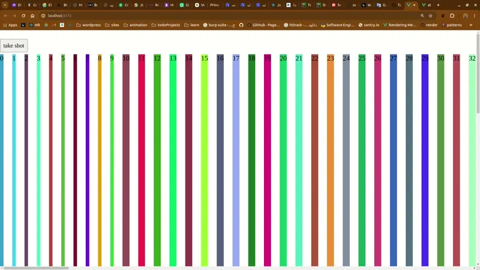

[Downloads](https://github.com/sedmedgh/hcanvaser/releases)

[](https://www.npmjs.org/package/hcanvaser)
[](https://www.npmjs.org/package/hcanvaser)

#### JavaScript HTML renderer

The script allows you to take "screenshots" of webpages or parts of it, directly on the users browser. The screenshot is based on the DOM and as such may not be 100% accurate to the real representation as it does not make an actual screenshot, but builds the screenshot based on the information available on the page.

### Advantage over other packages
* Supports nested elements against html2canvas
* Supports fontFaces and custom elements and styles
* Supports scrolled element against html-to-image and dom-to-image

### How does it work?

The script renders the current page as a canvas image, by reading the DOM and the different styles applied to the elements.

It does **not require any rendering from the server**, as the whole image is created on the **client's browser**. However, as it is heavily dependent on the browser, this library is *not suitable* to be used in nodejs.

The script is still in a **very experimental state**, so I don't recommend using it in a production environment nor start building applications with it yet, as there will be still major changes made.

### Browser compatibility

The library should work fine on the following browsers (with `Promise` polyfill):

* Firefox 3.5+
* Google Chrome
* Opera 12+
* IE9+
* Safari 6+

As each CSS property needs to be manually built to be supported, there are a number of properties that are not yet supported.

### Usage

The hcanvaser library utilizes `Promise`s and expects them to be available in the global context. If you wish to
support [older browsers](http://caniuse.com/#search=promise) that do not natively support `Promise`s, please include a polyfill such as
[es6-promise](https://github.com/jakearchibald/es6-promise) before including `hcanvaser`.

To render an `element` with hcanvaser, simply call:
` hcanvaser(element[, options]);`

The function returns a [Promise](https://developer.mozilla.org/en-US/docs/Web/JavaScript/Reference/Global_Objects/Promise) containing the `<canvas>` element. Simply add a promise fulfillment handler to the promise using `then`:
```ts
  const screenshotTarget = document.documentElement
  const style = getComputedStyle(screenshotTarget)
  const fontFaceName = style.getPropertyValue('--base-font-family')
  const canvas = await hcanvaser(screenshotTarget,{
    filterFontFace(font){
      if (font?.style['font-family'] === fontFaceName)
        return true
      return false
    },
  })
  const screenShot = canvas.toImage('webp', 0.95)
```

### Building

You can download ready builds [here](https://github.com/sedmedgh/hcanvaser/releases).

Clone git repository:
```shell
$ git clone https://github.com/sedmedgh/hcanvaser.git
Install dependencies:

$ npm i
Build browser bundle

$ npm run build
```


### TODO List
- [ ] Select element like inspect element and then take shot
- [ ] Placing the loading for the Element that we are taking a picture of that
